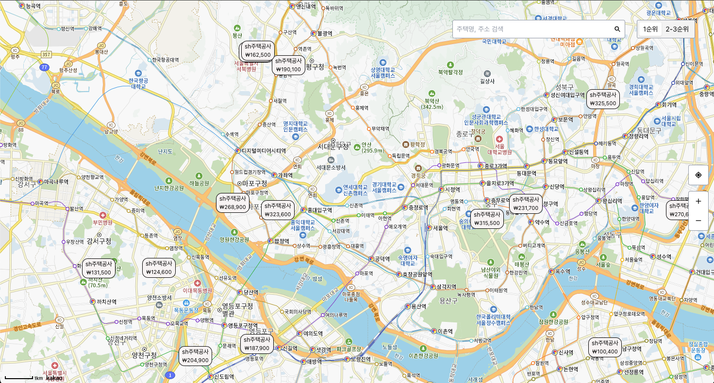
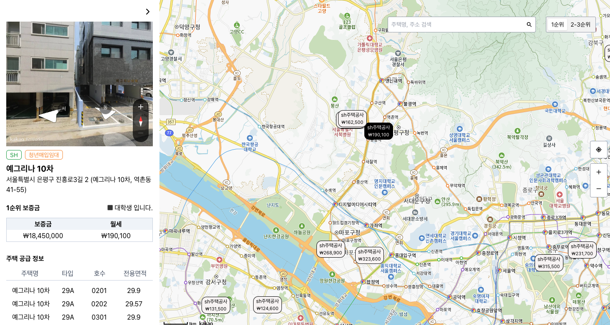

# 공공임대주택 지도 서비스

배포 url: <a href="https://map-project-phi.vercel.app">[https://map-project-phi.vercel.app](https://map-project-phi.vercel.app)</a>

## 프로젝트 소개

- 기존에 한 페이지에서 확인이 어려웠던 공공주택 정보를
  하나의 페이지에서 확인할 수 있도록 하고싶어서 만들게 되었습니다.
- kakao map api를 사용한 프로젝트로 서드 파티 라이브러리를 활용해 생성한 프로젝트 입니다.
- 주소별 마커가 등록되어있어 주택 위치를 빠르게 파악 가능합니다.
- 각각의 주택 상세정보를 마커에서 확인할 수 있습니다.
- 주택명, 주소로 검색이 가능하여 원하는 주택을 찾을 수 있습니다.
   

## 1. 개발 환경

Front: React.js, TypeScript, Zustand, TailwindCss, React Query
Back: Firebase real database
bundler: Vite
deploy: Vercel

   

## 2. 개발 기술 채택한 이유

> React로 프로젝트를 개발한 이유

- React와 Vue를 현업에서 경험해 본 결과 React와 TypeScript의 호환성이 더 좋기도하고, 혼자 개발할 때 참고할만한 자료가 많은 React가 더 좋을 듯 싶어서 선택하게 되었다.

> 상태 관리 라이브러리로 zustand를 채택한 이유

- Redux, mobx등 서치해본 결과 빠르게 적용할 수 있는 zustand가 내 프로젝트에 적합할 듯 싶어서 선택하게 되었다.

- <a href="https://ember-fontina-aa1.notion.site/React-c59b06c4c09341778ccc521ff2a05142" target="_blank">채택 과정이 궁금하시다면</a>

> 번들러로 webpack이 아닌 vite를 선택한 이유

- 설정 파일이 필요하지 않고 개발 시 빠르게 시작할 수 있다는 장점이 있음.
- 불필요한 리소스를 불러오지 않고, 필요한 리소스만 렌더링 할 수 있게 만든 구조.

   

## 3. 프로젝트 상세 설명

1. <b>주소별 경도, 위도 정보를 불러와 마커표시</b>

- sh주택공사홈페이지에 게시된 주택정보 엑셀파일을 JSON 데이터로 변환하는 작업을 실행
- 500-600개의 데이터 중 중복 데이터를 제거한 후, 주소 데이터를 kakaoMap api에 경도 위도 요청하여 마커 데이터를 지도에 렌더링
- 경도 위도 데이터를 병렬로 요청함으로써, 초기 렌더링 시 마커 렌더링 시간 단축
  

2. <b>마커 이벤트 등록 후, 상세 주택 정보 불러오기</b>

- 마커별 클릭 이벤트를 등록하여, 주택별 상세 정보를 렌더링
- 주택 상세 컴포넌트에 동적 import를 적용하여 초기 렌더링시에 영향을 주지 않도록 개발
  

3. <b>주택명 or 주소 검색</b>

- 동시성 렌더링으로 구현하여, 결과에 따른 입력에 영향을 주지 않음
- 주소와 주택명을 검색할 수 있음
  

- 그 외의 작은 기능들

  - 지도 확대 및 축소
  - 내 위치 중심으로 렌더링 및 내 위치 정보 표시
  - 순위 별 가격 렌더링 필터

 

## 4. 기능 추가 및 개선 목표

- 공고 예정 주택 및 공고가 끝난 주택을 나눠서 렌더링
- 내 순위 확인하기
- 모바일 최적화
